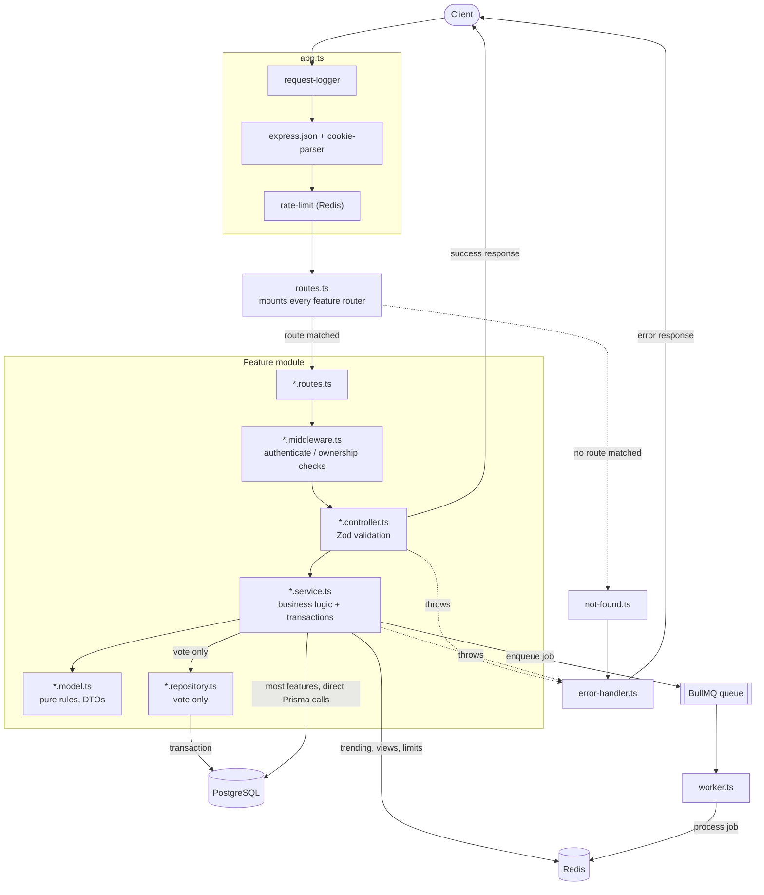

# Huddle

A Stack Overflow-style Q&A platform API. Users ask questions, answer them, vote, and build reputation over time.

This project exists to apply Clean Architecture and CQRS-style thinking — normally exercised in .NET — to the Node.js ecosystem, using a feature set (concurrent voting, full-text search, background jobs, rate limiting) that's deliberately harder than CRUD.

## Tech stack

| Concern            | Choice                         |
| ------------------ | ------------------------------ |
| Runtime            | Node.js, TypeScript            |
| HTTP framework     | Express                        |
| Database           | PostgreSQL                     |
| ORM                | Prisma                         |
| Cache / structures | Redis (ioredis)                |
| Background jobs    | BullMQ                         |
| Validation         | Zod                            |
| Auth               | JWT (access + refresh), argon2 |
| Testing            | Vitest, Testcontainers         |
| Infra (local)      | Docker Compose                 |

## Features

* **Questions, answers, comments, tags** — standard Q&A content model, tags as a many-to-many relation.
* **Tag autocomplete and synonym resolution** — typing a prefix matches both real tags and known synonyms (`nodejs` → `Node.js`) via a Redis-cached, cache-optional lookup; posting or creating a tag deduplicates by a normalized slug so `"Node.js"`, `"node js"`, and `"NODE-JS"` all resolve to the same row.
* **Voting** — upvote/downvote on questions and answers, with reputation changes applied atomically and one vote per user per target enforced at the database level.
* **Accepted answers** — a question's author can mark one answer accepted.
* **Full-text search** — search questions by title and body, ranked by relevance, using PostgreSQL's built-in text search rather than a separate search service.
* **Trending questions** — a live leaderboard backed by a Redis sorted set.
* **View counters** — tracked in Redis and flushed to Postgres periodically, so page views don't cost a database write each time.
* **Rate limiting** — a sliding-window limiter on posting, backed by Redis.
* **Notifications** — answer and comment notifications are queued and processed by a separate worker process, not inline in the request.
* **Auth** — short-lived JWT access tokens, long-lived rotating refresh tokens with reuse detection, argon2 password hashing.

## Architecture

Huddle is a modular monolith: one deployable process, one database, but internal boundaries strict enough that any feature could be extracted into its own service later without a rewrite.

### Folder structure

```
huddle/
├── prisma/
│   ├── schema.prisma
│   ├── models/
│   │   ├── user.prisma
│   │   ├── question.prisma
│   │   ├── answer.prisma
│   │   ├── comment.prisma
│   │   ├── tag.prisma
│   │   ├── tag-synonym.prisma
│   │   ├── vote.prisma
│   │   └── refresh-token.prisma
│   ├── migrations/
│   └── seed.ts
├── prisma.config.ts
│
├── src/
│   ├── features/
│   │   ├── question/
│   │   │   ├── question.schema.ts       zod input schemas
│   │   │   ├── question.model.ts        types, response shapes, pure rules
│   │   │   ├── question.service.ts      business logic
│   │   │   ├── question.controller.ts   parses request, calls service
│   │   │   ├── question.routes.ts       endpoint definitions
│   │   │   ├── question.middleware.ts   e.g. requireQuestionOwner
│   │   │   ├── index.ts                 public contract
│   │   │   └── __tests__/
│   │   ├── answer/
│   │   ├── comment/
│   │   ├── tag/
│   │   │   ├── tag.schema.ts            zod input schemas
│   │   │   ├── tag.model.ts             types, slugify, dedupeById, rankByPopularity
│   │   │   ├── tag.cache.ts             Redis autocomplete cache, fails open to Postgres
│   │   │   ├── tag.service.ts           search, resolve-by-slug, find-or-create, create
│   │   │   ├── tag.controller.ts
│   │   │   ├── tag.routes.ts
│   │   │   ├── index.ts                 public contract
│   │   │   └── __tests__/
│   │   ├── user/
│   │   ├── vote/
│   │   │   ├── vote.schema.ts
│   │   │   ├── vote.model.ts            vote transition rules
│   │   │   ├── vote.repository.ts       the one repository in the app
│   │   │   ├── vote.service.ts          the transaction lives here
│   │   │   ├── vote.controller.ts
│   │   │   ├── vote.routes.ts
│   │   │   ├── index.ts
│   │   │   └── __tests__/
│   │   ├── auth/
│   │   ├── search/
│   │   ├── trending/
│   │   └── notification/
│   │       ├── notification.queue.ts    producer
│   │       ├── notification.worker.ts   consumer
│   │       └── notification.service.ts
│   │
│   ├── shared/
│   │   ├── middlewares/
│   │   │   ├── authenticate.ts
│   │   │   ├── error-handler.ts
│   │   │   ├── rate-limit.ts
│   │   │   ├── request-logger.ts
│   │   │   └── not-found.ts
│   │   ├── lib/
│   │   │   ├── prisma.ts
│   │   │   ├── redis.ts
│   │   │   ├── queue.ts
│   │   │   └── logger.ts
│   │   ├── errors/
│   │   │   ├── app-error.ts
│   │   │   └── prisma-error.ts          P2002 → ConflictError
│   │   ├── types/
│   │   │   └── express.d.ts
│   │   ├── catch-async.ts
│   │   └── validate.ts
│   │
│   ├── config/
│   │   └── env.ts                       zod-validated process.env
│   │
│   ├── docs/
│   │   ├── openapi.ts
│   │   └── swagger.routes.ts
│   │
│   ├── routes.ts                        mounts every feature router
│   ├── app.ts                           middleware + config, no route defs
│   ├── server.ts                        app.listen + graceful shutdown
│   └── worker.ts                        BullMQ workers entry point
│
├── tests/
│   ├── integration/
│   │   ├── vote-concurrency.test.ts
│   │   ├── auth-rotation.test.ts
│   │   ├── accept-answer.test.ts
│   │   └── search.test.ts
│   └── setup/
│       ├── testcontainers.ts
│       └── global-setup.ts
│
├── docker-compose.yml
├── vitest.config.ts
├── vitest.integration.config.ts
└── package.json
```

### Layer rules

Each feature is organized as a small stack of layers with a strict dependency direction — outer layers depend on inner ones, never the reverse:

| File                | Responsible for                                                              | Never does                                  |
| ------------------- | ---------------------------------------------------------------------------- | ------------------------------------------- |
| `*.routes.ts`     | Mapping paths to controllers, mounting feature-local middleware              | Validation, business logic, database access |
| `*.controller.ts` | Parsing the request with Zod, calling the service, shaping the HTTP response | Business rules, Prisma calls                |
| `*.service.ts`    | Business logic, orchestration, transactions                                  | Reading `req`/`res`                     |
| `*.model.ts`      | Types, response DTOs, pure domain rule functions                             | Importing the Prisma client, any I/O        |
| `*.schema.ts`     | Zod schemas and their inferred input types                                   | Anything else                               |
| `*.repository.ts` | Prisma queries (only present in `vote`)                                    | Business rules                              |
| `index.ts`        | Re-exporting the feature's public surface                                    | Re-exporting internals                      |

Services take plain arguments and return plain data — no `req`, no `res` — which is what lets them be called from both the HTTP layer and, where relevant, from workers or tests without an Express context in sight.

Cross-feature calls go through `index.ts` only. `vote` importing from `question` means importing `question/index.ts`, never reaching into `question/question.service.ts` directly. This is enforced with an ESLint `no-restricted-imports` rule rather than left to convention.

### Application flow



Every request enters through `app.ts`'s middleware stack, gets routed into exactly one feature, and flows down the layer stack in one direction only — a controller never reaches past its own service, and a service never reaches past its own model or repository. Anything thrown at any layer is caught by `error-handler.ts`, never handled ad hoc partway down the stack.

### Request lifecycle: `POST /api/v1/votes/questions/:id`

1. `app.ts` middleware runs first — request logging, JSON parsing, the Redis-backed rate limiter.
2. `routes.ts` has mounted `voteRoutes` at `/votes`; the feature's own router matches `/questions/:id`.
3. `authenticate` (feature-local middleware) verifies the JWT and attaches `req.user`.
4. `vote.controller.ts` parses the body against `castVoteSchema` and calls `vote.service.castVote(input, userId)` — no `req` beyond this point.
5. `vote.service.ts` opens a Prisma interactive transaction: insert the vote row, update the question's score, update the author's reputation. All three commit together or not at all.
6. The insert relies on a composite unique constraint on `(userId, targetId)`. A concurrent duplicate vote is rejected by Postgres with a `P2002` error, translated by `shared/errors/prisma-error.ts` into a `409 Conflict` — the database is the arbiter of the race, not application code.
7. After the transaction commits, the service updates the Redis trending sorted set and enqueues a notification job. Neither happens inside the transaction.
8. The controller sends the response; if anything threw along the way, `error-handler.ts`, mounted last in `app.ts`, is what actually writes the error response.

## Engineering decisions

**Feature-based structure instead of flat MVC.** Grouping by technical role (`routes/`, `controllers/`, `services/`) scales poorly — adding one feature means touching four folders, and nothing tells you where a business rule lives once the app grows. Grouping by entity means a feature can be read, tested, and reasoned about in one folder. The trade-off is more ceremony per feature than a flat layout; kept manageable by only introducing a repository where a feature's complexity (`vote`) actually justifies it.

**A database constraint, not an application check, prevents double-voting.** A naive "check if a vote exists, then insert" has a race condition — two concurrent requests can both pass the check before either writes. The unique constraint on `(userId, targetId)` closes that gap regardless of timing, and the transaction wrapping the vote, score, and reputation writes ensures none of the three can land without the others.

**PostgreSQL full-text search instead of Elasticsearch.** At this scale, a weighted, GIN-indexed `tsvector` generated column gives ranked, language-aware search with no additional service to run, deploy, or keep in sync. Prisma doesn't model `tsvector` natively, so this is the one place the app drops to `$queryRaw` — a deliberate, isolated exception rather than a systemic one.

**Workers run as a separate process from the API.** Sending a notification email inside the request handler would make the response as slow as the mail provider and would occupy Node's single thread. `worker.ts` runs independently of `server.ts`, sharing the same feature code, so a slow or failing job can't degrade API latency and the two can be scaled separately.

**Integration tests run against real PostgreSQL via Testcontainers, not mocks.** The properties most worth testing here — the unique constraint rejecting a concurrent vote, a failed transaction leaving no partial writes, a reused refresh token being rejected — are properties of the database, not of application code. A mocked Prisma client can only confirm a function was called with certain arguments; it can't catch a real race condition. Pure logic (reputation math, vote-transition rules) is still covered by fast, colocated unit tests with no infrastructure involved.

**Tags deduplicate by slug, not by name, and synonyms redirect what slugging can't normalize.** A tag's `slug` is derived from its `name` (`slugify`: lowercase, punctuation collapsed to hyphens, `+`/`#` spelled out so `C`, `C++`, and `C#` stay distinct) and is the actual lookup and uniqueness key. Case and punctuation variants of the same name — `"Node.js"`, `"node js"`, `"NODE-JS"` — slugify to the same value and land on the same row for free; no moderation needed. Genuinely different spellings that slugify differently (`nodejs`, `node`) can't be normalized this way, so a separate `TagSynonym` table maps them onto the canonical tag's slug. Creating a brand-new tag under concurrent load has the same race as double-voting: two requests can both see "doesn't exist" and both try to insert. The unique constraint on `slug` — not a check-then-insert in application code — is what actually prevents the duplicate; the losing request just re-reads the row the winner wrote. Autocomplete sits behind a Redis cache that is explicitly allowed to fail: a `get`/`set` error is logged and swallowed rather than thrown, so a Redis outage degrades autocomplete to a slower, Postgres-backed query instead of a 500.

**Refresh tokens rotate and are stored server-side.** A JWT can't be revoked once issued, so a stolen long-lived token is a real liability. Splitting into a short-lived access token and a longer-lived, database-backed, single-use refresh token means a stolen access token expires quickly on its own, and a stolen refresh token can be invalidated by deleting its row. Rotation additionally makes theft detectable: if an already-used refresh token is presented again, the whole token family is revoked and the user is forced to log in again.

## Getting started

### Prerequisites

* Node.js (LTS)
* Docker and Docker Compose

### Setup

```bash
git clone <repo-url>
cd huddle
npm install
cp .env.example .env
```

Start Postgres and Redis:

```bash
docker compose up -d
```

Run migrations and seed data:

```bash
npx prisma migrate dev
npx prisma db seed
```

Start the API:

```bash
npm run dev
```

Start the background worker, in a separate terminal:

```bash
npm run worker
```

The API is available at `http://localhost:3000/api/v1`, with OpenAPI docs at `http://localhost:3000/docs`.

## Testing

Unit tests (pure logic, colocated with each feature, no infrastructure required):

```bash
npm run test
```

Integration tests (spin up a real Postgres container via Testcontainers, run migrations, and tear down after):

```bash
npm run test:integration
```

<!-- TODO: add CI badge once a pipeline is configured --> 
## API overview

| Group     | Endpoints                                                                                                               |
| --------- | ----------------------------------------------------------------------------------------------------------------------- |
| Auth      | `POST /auth/register`,`POST /auth/login`,`POST /auth/refresh`,`POST /auth/logout`                               |
| Questions | `GET /questions`,`GET /questions/:id`,`POST /questions`,`PATCH /questions/:id`,`DELETE /questions/:id`        |
| Answers   | `POST /questions/:id/answers`,`POST /answers/:id/accept`                                                            |
| Comments  | `POST /questions/:id/comments`,`POST /answers/:id/comments`                                                         |
| Votes     | `POST /votes/questions/:id`,`POST /votes/answers/:id`,`DELETE /votes/questions/:id`,`DELETE /votes/answers/:id` |
| Tags      | `GET /tags?q=&limit=`(autocomplete, or popular tags with no query),`GET /tags/:slug`,`POST /tags`               |
| Search    | `GET /search?q=`                                                                                                      |
| Trending  | `GET /trending`                                                                                                       |

`GET /tags/:slug/questions` is planned but blocked on the `question` feature, which doesn't exist yet.

<!-- TODO: full request/response schemas are documented in the generated OpenAPI spec at /docs --> ## Roadmap

* [ ] Split `vote` and `notification` into independently deployable services, using the existing `index.ts` boundaries as the seam
* [ ] Real-time notifications over WebSockets, backed by Redis pub/sub
* [ ] Reputation-gated moderation actions (edit, close, delete)
* [ ] Admin/moderator role and permissions model
